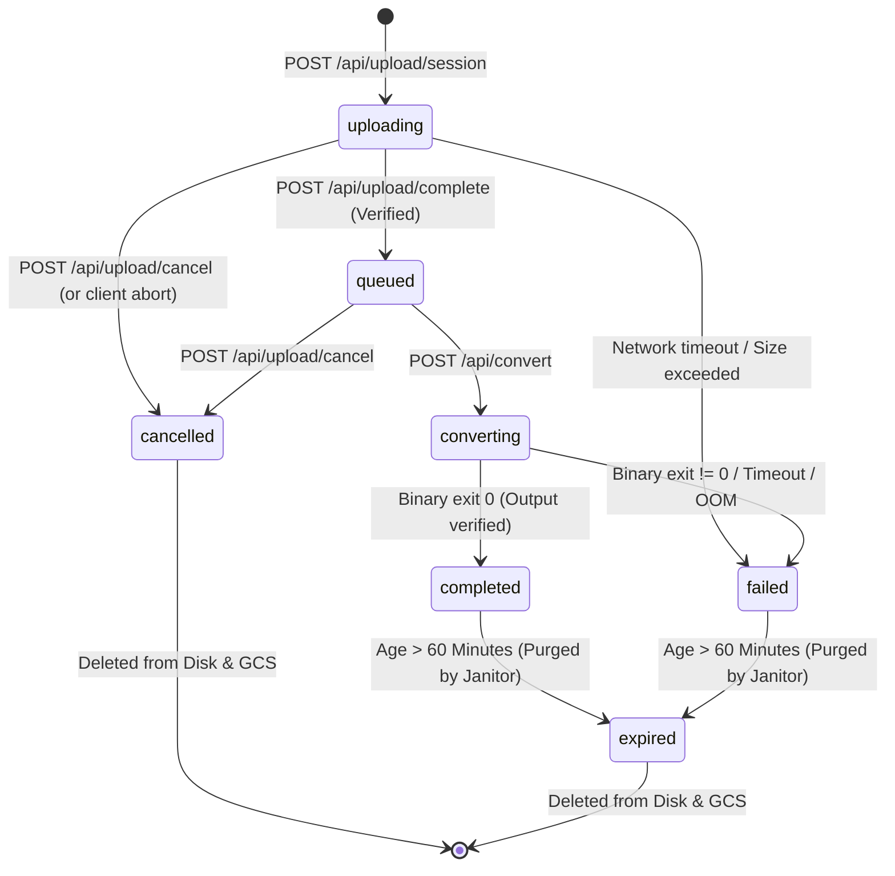

# PROJECT_FULL_CONTEXT.md
# Master Technical Architecture, Operational Context & Engineering Handoff Audit

> **Document Status:** Authoritative Master Technical Reference  
> **Repository:** `luongjuan123/convert-all` (`universal-file-converter`)  
> **Workspace Path:** `/home/juan/Work Space/Money`  
> **Production Target:** Google Cloud Run (`universal-file-converter` in `us-central1`) + Firebase Hosting (`convertall-site`)  
> **Public Domains:** `https://convertall.site` (Custom Domain), `https://convertall-site.web.app` (Firebase Edge Default)  
> **Audit Date:** October 7, 2026  
> **Primary Maintainer:** Senior Systems Architect / Full-Stack Lead  

---

## Table of Contents

1. [Project Identity & Provenance](#1-project-identity--provenance)
2. [Executive Summary & System Purpose](#2-executive-summary--system-purpose)
3. [Template Reconciliation & Scope Verification](#3-template-reconciliation--scope-verification)
4. [Complete Feature Inventory](#4-complete-feature-inventory)
5. [End-to-End System Architecture](#5-end-to-end-system-architecture)
6. [Directory Structure & File Inventory](#6-directory-structure--file-inventory)
7. [Technology Stack & Dependency Catalog](#7-technology-stack--dependency-catalog)
8. [Authentication, User Identity & Session Model](#8-authentication-user-identity--session-model)
9. [Authorization, Roles & Trust Boundaries](#9-authorization-roles--trust-boundaries)
10. [Database, Storage & Data Persistence Architecture](#10-database-storage--data-persistence-architecture)
11. [Firestore Security Rules & Indexes Audit](#11-firestore-security-rules--indexes-audit)
12. [Conversion Engine & Format Registry System](#12-conversion-engine--format-registry-system)
13. [Binary Execution & Subprocess Isolation Subsystem](#13-binary-execution--subprocess-isolation-subsystem)
14. [Upload, Verification & Ingestion Lifecycle](#14-upload-verification--ingestion-lifecycle)
15. [Job Lifecycle, State Transitions & Atomic Invariants](#15-job-lifecycle-state-transitions--atomic-invariants)
16. [Download, Range Streaming & Batch ZIP Pipeline](#16-download-range-streaming--batch-zip-pipeline)
17. [Result Previews & Derivative Generation System](#17-result-previews--derivative-generation-system)
18. [Monetization & Google AdSense Integration](#18-monetization--google-adsense-integration)
19. [Frontend Architecture, UI State & Interaction Model](#19-frontend-architecture-ui-state--interaction-model)
20. [Comprehensive REST API Inventory](#20-comprehensive-rest-api-inventory)
21. [End-to-End Data Flows](#21-end-to-end-data-flows)
22. [Security Audit & Vulnerability Assessment](#22-security-audit--vulnerability-assessment)
23. [Performance, Concurrency & Resource Scaling Audit](#23-performance-concurrency--resource-scaling-audit)
24. [Reliability & Data Consistency Analysis](#24-reliability--data-consistency-analysis)
25. [Known Bugs, Regressions & Suspicious Code Areas](#25-known-bugs-regressions--suspicious-code-areas)
26. [Environment Variables & Configuration Matrix](#26-environment-variables--configuration-matrix)
27. [Deployment, Infrastructure & CI/CD Pipelines](#27-deployment-infrastructure--cicd-pipelines)
28. [Local Development & Environment Setup](#28-local-development--environment-setup)
29. [Testing Suite & Quality Verification](#29-testing-suite--quality-verification)
30. [Git & Repository State](#30-git--repository-state)
31. [Critical System Invariants (Non-Negotiable)](#31-critical-system-invariants-non-negotiable)
32. [Do Not Break These (Engineer Safety Guardrails)](#32-do-not-break-these-engineer-safety-guardrails)
33. [Future Developer Guide ("How Do I Modify X?")](#33-future-developer-guide-how-do-i-modify-x)
34. [Architectural Technical Debt Register](#34-architectural-technical-debt-register)
35. [Recommended Engineering Roadmap](#35-recommended-engineering-roadmap)
36. [Master Subsystem Reference Table](#36-master-subsystem-reference-table)

---

## 1. Project Identity & Provenance

### 1.1 Core Identification
- **Project Name:** Universal File Converter
- **NPM Package Name:** `universal-file-converter` (v1.0.0, marked `"private": true`)
- **Repository Slug:** `luongjuan123/convert-all`
- **Current Git Branch:** `main`
- **Current Commit Hash:** `1fd9a87b569f9d9af9b5b47fba94a5dce4e2d559`
- **Commit Author:** `luongjuan123 <dungpubgame@gmail.com>`
- **Commit Date:** Mon Sep 28 21:09:33 2026 +0700
- **Primary Domain:** `https://convertall.site` (Custom Domain provisioned in Firebase Hosting)
- **Fallback / CDN Edge Domain:** `https://convertall-site.web.app` (Default Firebase Hosting CDN)
- **Google Cloud Platform Project ID:** `convertall-site` (Found in `.firebaserc:3`, `scripts/deploy-production.sh:4`, `gcloud config`)
- **Google Cloud Run Service:** `universal-file-converter` (Region: `us-central1`, default port 8080)
- **Package Manager:** `npm` (Lockfile: `package-lock.json` v3)
- **Node Runtime:** Node.js v20 LTS (`node:20-slim` container base)
- **Python Runtime:** Python 3.10+ (System packages `python3`, `python3-pip`)

### 1.2 Verification Taxonomy
To preserve architectural honesty, every claim throughout this document adheres to strict evidentiary categorization:
1. **[VERIFIED FROM CODE]:** Directly demonstrated by reading source code lines, configurations, or verified via deterministic runtime test output.
2. **[INFERRED FROM CODE]:** Deductions based on configuration values, script commands, or architecture patterns (clearly labeled with rationale).
3. **[UNKNOWN / NEEDS CONFIRMATION]:** Areas where infrastructure states outside the local repository (e.g. external DNS registrar TTLs or live Google Cloud IAM service account roles) cannot be established purely from code.

---

## 2. Executive Summary & System Purpose

### 2.1 Problem Statement
Mainstream commercial online conversion platforms (such as Smallpdf, CloudConvert, or Zamzar) monetize conversion workflows through artificial friction:
1. Imposing tight paywalls and file-size caps (typically 15 MB to 50 MB for unauthenticated guests).
2. Mandating account registration, email verification, and credit card subscriptions for modern multi-hundred-megabyte media or 4K phone recordings.
3. Retaining user document metadata indefinitely, compromising user confidentiality.
4. Serving disruptive advertisements (pop-unders, interstitial redirects, disguised download buttons) that inflict layout shifts and browser degradation.

### 2.2 System Mission
**Universal File Converter** is an open-source, friction-free, anonymous, privacy-guaranteed file conversion platform. It runs a single containerized Next.js 16 full-stack application on **Google Cloud Run** behind **Firebase Hosting CDN**.

The platform provides:
- **Zero-Barrier Anonymity:** No accounts, no passwords, no email collection, no tracking cookies.
- **Large File Handling Up to 2 GB:** A dual-mode ingestion architecture supporting standard multi-part uploads and direct resumable uploads to Google Cloud Storage (`gs://convertall-site-temp-storage`).
- **Cryptographic Ephemeral Lifecycle:** All uploaded and converted artifacts are strictly purged from both disk and object storage within 60 minutes (`siteConfig.fileExpirationMinutes`).
- **Native Binary Execution:** Converts files on serverless container infrastructure using open-source utilities: **FFmpeg 6+**, **LibreOffice 7.4+ (headless)**, **Ghostscript 10+**, **PyMuPDF / pdf2docx**, **Sharp (`libvips`)**, and **pdf-lib**, reducing third-party SaaS conversion API costs to **$0.000**.
- **Monetization via Layout-Stable AdSense:** Non-intrusive Google AdSense slots with zero Cumulative Layout Shift (CLS) safeguards and Google Consent Mode v2 integration.

### 2.3 Persona Perspectives

#### End User (Everyday Web Visitor)
- Lands on `https://convertall.site` or a specialized SEO tool landing page (`/pdf-to-word`, `/mp4-to-mp3`, etc.).
- Drags single or multiple files into an interactive dropzone.
- Sees immediate auto-detection of compatible formats.
- Observes live upload progress (speed in MB/s, estimated remaining time, byte counters).
- Previews converted documents, images, audio, video, or text directly inside the browser using an interactive modal before downloading.
- Downloads individual files or a consolidated ZIP archive containing all converted items.

#### Developer / Maintainer
- Operates a unified Next.js 16 App Router repository written in 100% TypeScript.
- Runs unit, integration, and security tests via Node's native test runner (`npm test`).
- Deploys frontend rewrites and backend container revisions with a single terminal command (`bash scripts/deploy-production.sh`).
- Controls memory, timeouts, resource classes, and format handlers from central declarative configuration modules (`src/config/site.ts`, `src/lib/conversion/registry.ts`).

#### Cloud Infrastructure & Cost Model
- Container instances scale to **zero** (`--min-instances 0`) during traffic droughts, keeping compute costs at **$0**.
- Auto-scales up to a safety ceiling of 5 instances (`--max-instances 5`) to prevent runaway denial-of-wallet spikes.
- Temporary files reside in memory-backed `/tmp` on Cloud Run or in Google Cloud Storage buckets subject to 1-hour expiration and 1-day bucket lifecycle auto-deletion.

---

## 3. Template Reconciliation & Scope Verification

The user prompt requests an exhaustive audit across a standardized checklist of system capabilities. Below is the explicit verification of whether these modules exist in this repository [VERIFIED FROM CODE]:

| Audit Category in Prompt | Status in Codebase | Concrete Evidence / Explanation |
| :--- | :--- | :--- |
| **Authentication & Registration** | **ABSENT (By Design)** | Anonymous platform. No user tables, sign-up forms, password hashes, or session cookies exist. Verified in `src/app`, `src/lib`. |
| **User Profiles, Ranks, XP, Tiers** | **ABSENT (By Design)** | No gamification or user state tracking exists. Verified. |
| **Problem Solving, Judge, ICPC Contests** | **ABSENT (Not an OJ)** | This is a file format conversion utility, **not** an online judge or coding competition platform. |
| **Organizations, Courses, Gradebooks** | **ABSENT** | No multi-tenancy, academic gradebooks, or organizational RBAC exists. |
| **Recruiter Assessments** | **ABSENT** | No candidate assessment workflows exist. |
| **Chat, Threads, Community** | **ABSENT** | No messaging, WebSockets, or forum threads exist. |
| **Email Service / SMTP** | **ABSENT (By Design)** | Zero email collection. No `nodemailer`, SendGrid, Postmark, or SMTP libraries are installed or referenced. |
| **Payment Gateways (Stripe, PayPal)** | **ABSENT** | Completely free service. Monetization is handled exclusively via Google AdSense ad slots (`src/components/AdSlot.tsx`). |
| **Firestore Database Collections** | **ABSENT** | Firestore is not used. Job state is held in an in-memory `Map` backed by GCS JSON blobs (`jobs/${jobId}.json`). |
| **Redis / Memorystore** | **ABSENT** | No Redis client (`ioredis`, `redis`) is installed in `package.json`. Cache and rate limiting use process memory. |
| **File Conversion Engine** | **PRESENT & VERIFIED** | 22 registered format conversion handlers across PDF, Office, Image, Audio, and Video (`src/lib/conversion/`). |
| **Multi-File Batch Conversion** | **PRESENT & VERIFIED** | Implemented via `useBatchConverter.ts`, `BatchControls.tsx`, `FileItemRow.tsx`. |
| **Result Previews & Derivatives** | **PRESENT & VERIFIED** | In-browser preview modal (`PreviewModal.tsx`) and Office-to-PDF sidecar generation (`office-derivative.ts`). |
| **Batch ZIP Archive Download** | **PRESENT & VERIFIED** | Streaming multi-file ZIP generation via `archiver` in `src/app/api/download/batch/route.ts`. |
| **Resumable 2 GB Storage** | **PRESENT & VERIFIED** | GCS resumable upload sessions and chunked streaming endpoints (`src/lib/storage/index.ts`). |
| **Rate Limiting & Security Defenses** | **PRESENT & VERIFIED** | IP token bucket limiter, magic byte validator, path traversal prevention (`src/lib/security/`). |
| **Automated Purge / Cleanup** | **PRESENT & VERIFIED** | 60-minute automated janitor via `/api/cleanup` and `src/scripts/cleanup.ts`. |
| **Google AdSense Monetization** | **PRESENT & VERIFIED** | Zero-CLS AdSlot components with Google Consent Mode v2 (`src/lib/advertising/`). |

---

## 4. Complete Feature Inventory

Below is the definitive inventory of all features implemented in the codebase:

### 4.1 Document & PDF Conversion Suite
- **PDF to Word (DOCX):**
  - *Implementation:* Spawns `python3 src/scripts/pdf_convert.py --mode docx` executing `pdf2docx.Converter`.
  - *Limits:* Max input 100 MB (`maxSizeBytes: 104857600`), 500 pages safety ceiling. Timeout: 180s.
  - *File:* `src/lib/conversion/converters/pdf.ts:75`.
- **PDF to Images (JPG / PNG):**
  - *Implementation:* Spawns `python3 src/scripts/pdf_convert.py` utilizing PyMuPDF (`fitz`) rendering vector pages at 150 DPI.
  - *Artifact Handling:* Multi-page documents generate separate image artifacts (`${base}_page_${num}.${ext}`). The first page is copied to the primary output path, and all subsequent pages are registered as individual `OutputArtifact` items with distinct download and preview URLs.
  - *Limits:* Max input 100 MB. Timeout: 120s.
  - *Files:* `src/lib/conversion/converters/pdf.ts:103-154`, `src/scripts/pdf_convert.py:16`.
- **PDF Text Extraction (TXT):**
  - *Implementation:* PyMuPDF text stream extraction (`page.get_text()`) written to UTF-8 `.txt`.
  - *Limits:* Max input 50 MB. Timeout: 60s.
  - *File:* `src/lib/conversion/converters/pdf.ts:155`.
- **Images to PDF (JPG / PNG to PDF):**
  - *Implementation:* Pure Node.js transformation using `pdf-lib`. Embeds image buffers (`pdfDoc.embedJpg`, `pdfDoc.embedPng`) onto scaled canvas pages.
  - *Limits:* Max input 50 MB. Timeout: 60s.
  - *File:* `src/lib/conversion/converters/pdf.ts:177-236`.
- **PDF Operations (Merge, Split, Compress):**
  - *Merge:* Uses `pdf-lib` to copy page indices from source documents into a unified `PDFDocument`. Max input 200 MB.
  - *Split:* Uses `pdf-lib` to isolate specific page indices. Max input 200 MB.
  - *Compress:* Invokes Ghostscript (`gs`) with `-sDEVICE=pdfwrite -dPDFSETTINGS=/ebook -dCompatibilityLevel=1.4`. Falls back gracefully to `pdf-lib` object-stream compaction if Ghostscript fails.
  - *File:* `src/lib/conversion/converters/pdf.ts:237-343`.

### 4.2 Raster & Modern Image Suite
- **Format Transcoding (JPG, PNG, WEBP, AVIF):**
  - *Implementation:* High-speed pipeline powered by `sharp` (`libvips`).
  - *EXIF Preservation:* Calls `.rotate()` on input pipelines to auto-orient mobile phone captures.
  - *Compression Tuning:* JPEG uses `mozjpeg: true`; PNG calculates compression level from user quality slider; WEBP/AVIF use hardware-accelerated quantization.
  - *Limits:* Max input 50 MB. Timeout: 30s.
  - *File:* `src/lib/conversion/converters/image.ts:6-175`.
- **HEIC / HEIF to JPG:**
  - *Implementation:* Transcodes Apple iOS HEIC images to JPEG using `heic-convert` (pure JavaScript/WASM).
  - *Limits:* Max input 50 MB. Timeout: 60s.
  - *File:* `src/lib/conversion/converters/image.ts:176-203`.
- **Image Compression:**
  - *Implementation:* Re-encodes JPEG/PNG/WEBP via Sharp with default 65% quality ceiling or user-selected quality parameter.
  - *File:* `src/lib/conversion/converters/image.ts:205-222`.

### 4.3 Video & Audio Transcoding Suite
- **Video Extraction to MP3:**
  - *Implementation:* Spawns `ffmpeg -i <input> -vn -b:a <bitrate> <output>` with `libmp3lame`.
  - *Tolerances:* Supports files up to 2 GB (`maxSizeBytes: 2147483648`). Configurable bitrates: 128k, 192k, 256k, 320k. Timeout: 600s (10 min).
  - *File:* `src/lib/conversion/converters/video.ts:28-50`.
- **Video Format Conversion (MOV to MP4, WEBM to MP4):**
  - *Implementation:* Transcodes containers to H.264 video (`libx264`, preset `fast`, CRF 23) and AAC audio.
  - *File:* `src/lib/conversion/converters/video.ts:98-142`.
- **MP4 to WEBM:**
  - *Implementation:* Encodes video via `libvpx-vp9` (CRF 30) with `libopus` audio.
  - *File:* `src/lib/conversion/converters/video.ts:52-73`.
- **Video to Animated GIF:**
  - *Implementation:* Spawns `ffmpeg -vf fps=10,scale=480:-1:flags=lanczos`.
  - *Limits:* 500 MB max input, 200 MB max output. Timeout: 300s.
  - *File:* `src/lib/conversion/converters/video.ts:75-96`.
- **Video Compression:**
  - *Implementation:* Constant Rate Factor encoding (`-preset faster -c:v libx264`). Presets: `quality` (CRF 22), `balanced` (CRF 28), `small` (CRF 32). Audio capped at 128k AAC.
  - *File:* `src/lib/conversion/converters/video.ts:144-169`.
- **Audio Transcoding (WAV, MP3, FLAC, M4A):**
  - *Implementation:* High-fidelity transcoding between lossless and lossy containers. WAV output uses 16-bit uncompressed PCM (`pcm_s16le` at 1411 kbps). MP3 conversions utilize `libmp3lame` up to 320 kbps.
  - *File:* `src/lib/conversion/converters/audio.ts:1-119`.

### 4.4 Microsoft Office Suite (LibreOffice Headless)
- **Word / PowerPoint / Excel to PDF:**
  - *Formats Supported:* DOCX, DOC, PPTX, PPT, XLSX, XLS.
  - *Implementation:* Spawns `libreoffice --headless --convert-to pdf --outdir <outDir> <inputPath>`. Handles discrepancy when LibreOffice outputs an un-prefixed filename by renaming to the expected output path.
  - *Limits:* Max input 100 MB. Timeout: 180s.
  - *File:* `src/lib/conversion/converters/office.ts:1-106`.

### 4.5 Multi-File Batch Conversion & Archive Pipeline
- **Concurrent Queue Orchestration:** Managed client-side by `src/hooks/useBatchConverter.ts`.
  - Enforces `MAX_CONCURRENT_UPLOADS = 3` and `MAX_CONCURRENT_CONVERSIONS = 2`.
  - Dynamically calculates common compatible formats across all pending files in the batch.
  - Provides bulk actions: "Convert All", "Download All (ZIP)", "Cancel All", "Retry Failed", "Clear Finished".
- **Batch ZIP Streaming:** Implemented in `src/app/api/download/batch/route.ts`.
  - Accepts GET query parameter `?jobs=id1,id2,id3` or POST JSON `{ jobIds: [...] }`.
  - Streams a zip archive generated on-the-fly via `archiver` with automatic duplicate filename disambiguation (`photo (1).png`, `photo (2).png`).

### 4.6 In-Browser Result Previews & Derivative Pipeline
- **Interactive Preview Modal:** Implemented in `src/components/converter/PreviewModal.tsx`.
  - *Images:* Zoom controls (50% to 250%), fit-to-screen, rotate.
  - *PDFs:* Embedded high-fidelity viewer via `<iframe>` targeting `/api/preview/[id]`.
  - *Videos & Audio:* Native HTML5 `<video>` and `<audio>` players supporting Range requests (HTTP 206) for seeking.
  - *Text:* Built-in syntax preview with 100 KB safety truncation and download trigger.
  - *Office Documents (DOCX/PPTX/XLSX):* On-demand sidecar generation (`src/lib/preview/office-derivative.ts`). Converts the Office output file to a `preview.pdf` derivative using LibreOffice, uploads it to GCS, and displays it in the PDF previewer.

---

## 5. End-to-End System Architecture

### 5.1 Real Physical Topology Diagram

```
                              [ CLIENT BROWSER ]
                                      |
         +----------------------------+----------------------------+
         | (Direct HTTPS Requests)                                 | (Direct XHR Binary Stream)
         v                                                         v
+-----------------------------+                           +-----------------------------+
|    FIREBASE HOSTING CDN     |                           |    GOOGLE CLOUD STORAGE     |
|   (convertall.site Edge)    |                           | (gs://convertall-site-temp) |
|  - Let's Encrypt SSL/TLS    |                           | - Resumable Upload Chunks   |
|  - Static Assets Cache      |                           | - CORS: PUT / GET / HEAD    |
|  - Rewrites /** -> CloudRun |                           | - 1-Day Lifecycle Purge     |
+-----------------------------+                           +-----------------------------+
         |                                                                 ^
         | (Reverse Proxy Ingress)                                         |
         v                                                                 |
+-----------------------------------------------------------------------+  |
|               GOOGLE CLOUD RUN WORKER CONTAINER                       |  |
|          Service: universal-file-converter (us-central1)               |  |
|               Image: Node.js 20-slim + System Binaries                |  |
|                                                                       |  |
|  +-----------------------------------------------------------------+  |  |
|  |                 Next.js 16.3.2 App Server (Port 8080)           |  |  |
|  |                                                                 |  |  |
|  |  [ Route Handlers: /api/* ]                                     |  |  |
|  |  - /api/upload/session ---> Validates & returns GCS/Local URL   |--+--+
|  |  - /api/upload/complete --> Validates object presence & size    |--+--+
|  |  - /api/convert ----------> Executes conversion binary pipeline |  |
|  |  - /api/preview/[id] -----> Streams inline with Range (HTTP 206)|  |
|  |  - /api/download/[id] ----> Streams attachment stream           |  |
|  |  - /api/download/batch ---> On-the-fly streaming ZIP archiver   |  |
|  |  - /api/cleanup ----------> Triggers file & job deletion        |  |
|  +-----------------------------------------------------------------+  |
|                                  |                                    |
|  +-----------------------------------------------------------------+  |
|  |               State & Storage Providers (Hybrid)                |  |
|  |  - In-Memory Jobs Store (Map) + GCS Backup (jobs/${jobId}.json) |  |
|  |  - In-Memory IP Rate Limiter (30 jobs / 15 min sliding window)  |  |
|  |  - Local File Storage: /tmp/file-converter-storage (RAM Disk)   |  |
|  +-----------------------------------------------------------------+  |
|                                  |                                    |
|  +-----------------------------------------------------------------+  |
|  |               Modular Conversion Subprocess Layer               |  |
|  |  - Sharp (libvips): JPG, PNG, WEBP, AVIF (EXIF-preserving)      |  |
|  |  - heic-convert: Apple HEIC -> JPG (Pure JS/WASM)               |  |
|  |  - pdf-lib: PDF generation, page merging & splitting           |  |
|  |  - Ghostscript 10: High-ratio PDF ebook compression             |  |
|  |  - FFmpeg 6+: Video/Audio transcoding, MP3 extraction, GIF      |  |
|  |  - LibreOffice 7.4: Headless DOCX/PPTX/XLSX -> PDF conversion   |  |
|  |  - Python 3.10 Helper: PyMuPDF (fitz) & pdf2docx bridge         |  |
|  +-----------------------------------------------------------------+  |
+-----------------------------------------------------------------------+
```

### 5.2 Architectural Component Boundaries
1. **Edge Boundary (Firebase Hosting):** Terminates global TLS, provides zero-configuration DDoS mitigation, serves static assets (`/_next/static/**`) with aggressive edge caching, and forwards dynamic requests (`/**`) directly to the Cloud Run backend service.
2. **Ingress Boundary (Next.js Route Handlers):** Enforces IP-based rate limiting, validates MIME types, strips hostile path characters, limits maximum payloads (2 GB global cap), and initializes cryptographically random UUID job tokens.
3. **Storage Boundary (Hybrid Storage Abstraction):** Decouples the application from physical disk locations. If GCS credentials are present, files are mirrored to `gs://convertall-site-temp-storage`, enabling horizontal scaling across multiple Cloud Run instances. If GCS is unconfigured (e.g. during local development), the system falls back seamlessly to the local filesystem (`/tmp/file-converter-storage`).
4. **Execution Boundary (Isolated Child Processes):** All external binaries (`ffmpeg`, `libreoffice`, `gs`, `python3`) are invoked using Node's `child_process.execFile` with strictly array-formatted arguments. The shell interpreter (`/bin/sh`) is never invoked, eliminating shell injection risks.
5. **Garbage Collection Boundary (The Janitor):** A dual-layer expiration mechanism purges all job artifacts older than 60 minutes via internal file stat queries and GCS lifecycle rules.

---

## 6. Directory Structure & File Inventory

```
/home/juan/Work Space/Money
├── .dockerignore                            # Excludes node_modules, .git, .next from Docker builds
├── .env.example                             # Template of supported environment variables
├── .firebase/                               # Local Firebase CLI cache
├── .firebaserc                              # Firebase project alias: "default": "convertall-site"
├── .gcloudignore                            # Excludes local temp directories from Cloud Build submissions
├── .gitignore                               # Standard Next.js & Node git exclusions
├── cors.json                                # Google Cloud Storage CORS configuration for browser direct upload
├── docker-compose.yml                       # Docker Compose specification for local container testing
├── Dockerfile                               # Multi-stage production container build (Node 20 + System Binaries)
├── eslint.config.mjs                        # ESLint v9 configuration with Next.js Core Web Vitals plugin
├── firebase.json                            # Firebase Hosting rewrite rules routing to Cloud Run
├── next.config.ts                           # Next.js compiler settings
├── package.json                             # Package manifests and npm scripts
├── package-lock.json                        # Exact pinned dependency lockfile
├── postcss.config.mjs                       # PostCSS configuration for Tailwind v4
├── PROJECT_FULL_CONTEXT.md                  # Master Technical Documentation (This file)
├── PROJECT_SUMMARY.md                       # Historical engineering summary (Sep 22, 2026)
├── README.md                                # Developer onboarding guide
├── tsconfig.json                            # TypeScript 5 strict compiler options
├── public/                                  # Static image assets and icons
│   ├── file.svg, globe.svg, next.svg...
├── scripts/
│   ├── deploy.sh                            # Development Cloud Run deployment script
│   └── deploy-production.sh                 # Production deployment pipeline (APIs, GCS, Artifact Registry, Run, Hosting)
└── src/
    ├── app/                                 # Next.js 16 App Router tree
    │   ├── layout.tsx                       # Root HTML shell, AdSense script injector, Header & Footer
    │   ├── page.tsx                         # Homepage: Hero, ConverterWidget, Features, Tool Grid
    │   ├── globals.css                      # Tailwind v4 import and base theme styles
    │   ├── favicon.ico                      # Site favicon
    │   ├── robots.ts                        # Robots.txt generator (disallows /api/)
    │   ├── sitemap.ts                       # Dynamic XML sitemap generator
    │   ├── ads.txt/route.ts                 # Google AdSense publisher verification endpoint
    │   ├── privacy/page.tsx                 # Legal Privacy Policy (1-hour auto-purge disclosure)
    │   ├── terms/page.tsx                   # Legal Terms of Service
    │   ├── [toolSlug]/page.tsx              # Dynamic SSG landing pages for 22 tools (JSON-LD WebApp & Breadcrumbs)
    │   └── api/                             # Backend REST Route Handlers
    │       ├── cleanup/route.ts             # Maintenance purge trigger (GET/POST)
    │       ├── convert/route.ts             # Triggers binary transformation
    │       ├── job/[id]/route.ts            # Queries job status, progress, download URL
    │       ├── preview/[id]/route.ts        # In-browser preview stream (HTTP 206 Range support)
    │       ├── download/[id]/route.ts       # Direct file download stream (HTTP 200 / 206)
    │       ├── download/batch/route.ts      # Multi-job streaming ZIP archiver
    │       └── upload/
    │           ├── route.ts                 # Multipart/form-data upload fallback
    │           ├── session/route.ts         # Initializes upload session (GCS resumable / Local chunk)
    │           ├── chunk/route.ts           # Receives raw binary byte streams
    │           ├── complete/route.ts        # Validates uploaded size & transitions status to queued
    │           └── cancel/route.ts          # Cancels job and deletes temporary files
    ├── components/
    │   ├── AdSlot.tsx                       # AdSense banner wrapper (Zero-CLS placeholder)
    │   ├── ConverterWidget.tsx              # Main interactive drag-and-drop file converter interface
    │   ├── Header.tsx                       # Global responsive top navigation bar
    │   ├── Footer.tsx                       # Global footer with format navigation & legal links
    │   └── converter/                       # Modular subcomponents for ConverterWidget
    │       ├── BatchControls.tsx            # Bulk action toolbar (Convert All, Download ZIP, etc.)
    │       ├── FileItemRow.tsx              # Individual file status row with speed, progress, preview
    │       ├── PreviewModal.tsx             # Modal previewer for images, PDFs, office docs, audio, video
    │       └── types.ts                     # UI batch converter TypeScript interfaces
    ├── config/
    │   └── site.ts                          # Central configuration: limits, metadata, and 22 tool definitions
    ├── hooks/
    │   └── useBatchConverter.ts             # Client-side state machine & concurrency queue manager
    ├── lib/
    │   ├── advertising/
    │   │   ├── ad-config.ts                 # AdSense slot IDs and page caps
    │   │   └── consent.ts                   # Google Consent Mode v2 initialization
    │   ├── cleanup/
    │   │   └── index.ts                     # Garbage collection logic (deletes expired jobs & files)
    │   ├── conversion/
    │   │   ├── registry.ts                  # Central catalog of all 22 format converters
    │   │   ├── python-helper.ts             # Subprocess bridge to src/scripts/pdf_convert.py
    │   │   └── converters/
    │   │       ├── audio.ts                 # FFmpeg audio transcoders (WAV, MP3, FLAC, M4A)
    │   │       ├── image.ts                 # Sharp image transcoders (JPG, PNG, WEBP, AVIF, HEIC)
    │   │       ├── office.ts                # LibreOffice document transcoders (DOCX, PPTX, XLSX)
    │   │       ├── pdf.ts                   # PDF manipulation (pdf-lib, Ghostscript, PyMuPDF)
    │   │       └── video.ts                 # FFmpeg video transcoders (MP4, WEBM, MOV, GIF)
    │   ├── jobs/
    │   │   └── store.ts                     # In-memory job repository with GCS persistence mirror
    │   ├── preview/
    │   │   └── office-derivative.ts         # On-demand Office-to-PDF preview sidecar generator
    │   ├── security/
    │   │   ├── rate-limit.ts                # IP-based sliding window rate limiter
    │   │   └── validation.ts                # Filename sanitization, path traversal, magic byte checks
    │   ├── storage/
    │   │   └── index.ts                     # Dual-mode Hybrid Storage provider (Local RAMDisk + GCS)
    │   └── types/
    │       └── converter.ts                 # TypeScript domain interfaces (JobRecord, ConverterHandler)
    ├── scripts/
    │   ├── cleanup.ts                       # CLI maintenance runner for cron jobs
    │   └── pdf_convert.py                   # Python helper script (PyMuPDF & pdf2docx)
    └── __tests__/                           # Automated test suite (Node.js test runner)
        ├── ad_banner.test.ts                # AdSense configuration & slot limit tests
        ├── converters.test.ts               # Binary conversion engine & security tests
        ├── large_file.test.ts               # 2 GB limit, sparse files & resumable session tests
        ├── preview_and_batch.test.ts        # Multi-page artifacts, Range preview & ZIP generation tests
        └── upload_lifecycle.test.ts         # End-to-end upload -> conversion -> download pipeline tests
```

---

## 7. Technology Stack & Dependency Catalog

| Layer | Technology | Exact Version in Manifest | Purpose | Important Implementation Notes |
| :--- | :--- | :--- | :--- | :--- |
| **Framework** | Next.js | `16.3.2` | Full-Stack Web Application Framework | Uses App Router with Turbopack compiler. |
| **UI Library** | React | `19.2.8` | Client & Server Component Architecture | React 19 concurrent features and Server Actions. |
| **DOM Engine** | React-DOM | `19.2.8` | Browser DOM rendering | Paired with React 19. |
| **Language** | TypeScript | `^5` (5.x) | Static typing & interface definitions | Configured in `tsconfig.json` with strict mode enabled. |
| **Styling** | Tailwind CSS | `^4` (4.x) | Utility-first CSS engine | Imported directly in `globals.css` via `@import "tailwindcss";`. |
| **Icons** | Lucide React | `^0.475.0` | Modern SVG iconography | Provides icons for file types, previews, and badges. |
| **Image Engine** | Sharp | `^0.33.5` | High-performance raster image transformations | Compiles with native `libvips`. Used for JPG/PNG/WEBP/AVIF. |
| **HEIC Decoder**| `heic-convert` | `^2.1.0` | Apple HEIC/HEIF image decoding | Pure JS/WASM module; converts iPhone photos to JPEG. |
| **PDF Engine** | `pdf-lib` | `^1.17.1` | Programmatic PDF creation and manipulation | Used for PDF page merging, splitting, and Image-to-PDF. |
| **Cloud Storage**| `@google-cloud/storage`| `^7.15.0` | Google Cloud Storage Node SDK | Manages resumable upload sessions, signed URLs, and GCS blobs. |
| **Archiver** | `archiver` | `^8.0.0` | Multi-file ZIP archive streaming | Generates on-the-fly ZIP streams for batch downloads. |
| **Utilities** | `uuid` | `^11.0.5` | Cryptographically random UUID generation | Assigns unguessable v4 UUIDs for all conversion jobs. |
| **CSS Utils** | `clsx` / `tailwind-merge` | `^2.1.1` / `^3.0.1` | Conditional class manipulation | Helper utilities for styling components. |
| **Runtime Script**| `tsx` | `^4.19.2` | TypeScript Execute engine | Executes `npm test` and `src/scripts/cleanup.ts` without build step. |
| **Linter** | ESLint | `^9` | Static code analysis | Configured in `eslint.config.mjs` with `eslint-config-next: 16.3.2`. |
| **Video Engine** | FFmpeg | `6.0+` (System) | Video & audio transcoding | System binary in container; compiled with x264, lame, opus, vpx. |
| **Office Engine**| LibreOffice | `7.4+` (System) | Headless document-to-PDF conversion | System binary in container (`libreoffice --headless`). |
| **PDF Engine** | Ghostscript | `10+` (System) | PDF ebook compression | System binary in container (`gs -sDEVICE=pdfwrite`). |
| **Python Libs** | PyMuPDF / pdf2docx | Python 3.10+ (pip) | High-fidelity PDF to DOCX & image rendering | Installed via pip: `pdf2docx`, `pymupdf` (`fitz`), `pillow`. |

---

## 8. Authentication, User Identity & Session Model

### 8.1 Anonymous By Design [VERIFIED FROM CODE]
Universal File Converter implements an **entirely unauthenticated user architecture**:
- **No User Records:** There is no `users` database table, collection, or state model.
- **No Passwords or Tokens:** No bcrypt, JWT, OAuth, or session cookies are set or verified.
- **No Email Capture:** The application never asks for or stores user email addresses.

### 8.2 Client Identity & Ephemeral Job Sessions
Instead of user sessions, user interaction is scoped strictly to **ephemeral conversion jobs**:
1. When a user selects a file, the client issues a `POST /api/upload/session` request.
2. The server generates a random UUID v4 string (`src/lib/jobs/store.ts:17`):
   ```typescript
   const jobId = uuidv4();
   ```
3. This `jobId` serves as the sole capability token for the conversion lifecycle.
4. The client holds this `jobId` in React component state (`src/hooks/useBatchConverter.ts`) and uses it to poll status (`/api/job/[id]`), stream chunks (`/api/upload/chunk?jobId=...`), trigger conversion (`/api/convert`), and download the result (`/api/download/[id]`).
5. Once the job expires (after 60 minutes) or is cancelled, the `jobId` becomes completely invalid.

---

## 9. Authorization, Roles & Trust Boundaries

### 9.1 Role Matrix
Because the application is anonymous, there are only two operational actor roles:

| Role | Definition | Capabilities | Boundaries |
| :--- | :--- | :--- | :--- |
| **Anonymous Visitor** | Any unauthenticated web client accessing the service. | Upload files up to 2 GB; convert files; preview outputs; download converted files; cancel own active jobs. | Enforced by client IP rate limiter (30 jobs per 15 min); cannot access server filesystem; cannot view files belonging to other jobs without guessing 128-bit UUIDs. |
| **Internal Janitor / Server Admin** | Internal system processes or cron runners. | Trigger global cleanup of files and jobs older than 60 minutes. | Invokes `runServerCleanup()` programmatically or via `/api/cleanup`. |

### 9.2 Trust Boundaries & Security Enforcements
1. **Filename Sanitization:** Input filenames from untrusted client uploads are sanitized using `sanitizeFilename()` (`src/lib/security/validation.ts:15`). Null bytes (`\0`), control characters, directory separators (`/`, `\`), and relative path traversal indicators (`..`) are stripped, and names are capped at 200 characters.
2. **Path Traversal Defense:** `preventPathTraversal()` verifies that any local filesystem target path strictly resolves inside the authorized temporary directory (`/tmp/file-converter-storage`).
3. **Magic Byte Verification:** `validateMagicBytes()` reads the first 12 bytes of uploaded files to ensure binary signatures match legitimate file formats (e.g. `%PDF`, `\x89PNG`, `\xFF\xD8\xFF` for JPEG, `RIFF` for WEBP, `PK\x03\x04` for Office ZIP containers).
4. **Active Content MIME Re-mapping:** In `src/app/api/preview/[id]/route.ts:71`, any file that produces an active content MIME type (`text/html` or `image/svg+xml`) is explicitly re-mapped to `text/plain; charset=utf-8` before being served inline, completely mitigating Cross-Site Scripting (XSS) on the application origin.

---

## 10. Database, Storage & Data Persistence Architecture

### 10.1 Database Reconcile: No Traditional Database
The project intentionally does not use a traditional relational database (PostgreSQL, MySQL) or NoSQL document database (MongoDB, Cloud Firestore).

### 10.2 Job State Persistence Architecture
State is maintained through a hybrid two-tier model:
1. **In-Memory Cache (`jobsMap`):**
   - Located in `src/lib/jobs/store.ts:6`.
   - Stored in a process-level `Map<string, JobRecord>()`.
   - Offers sub-millisecond lookups for active conversions.
2. **Google Cloud Storage Persistence Mirror:**
   - Implemented in `src/lib/storage/index.ts:291-321` and `src/lib/jobs/store.ts:46, 54, 83`.
   - Whenever a job is created or updated, its state is serialized to JSON and saved directly to GCS at `jobs/${jobId}.json`:
     ```typescript
     await gcsFile.save(JSON.stringify(jobData), { contentType: "application/json", resumable: false });
     ```
   - If a request hits a different Cloud Run instance where `jobsMap` does not have the job in memory, `getJob(jobId)` fetches and restores it from `jobs/${jobId}.json`.

### 10.3 Job Record Schema (`JobRecord`)

| Field | Type | Description |
| :--- | :--- | :--- |
| `jobId` | `string` (UUID v4) | Primary identifier. |
| `status` | `JobStatus` | Enum: `uploading` \| `queued` \| `converting` \| `completed` \| `failed` \| `expired` \| `cancelled`. |
| `converterId` | `string` | Target converter ID (e.g. `pdf-to-docx`, `mp4-to-mp3`). |
| `inputFilename` | `string` | Sanitized original filename. |
| `inputSize` | `number` | Size in bytes of input file. |
| `inputMimeType` | `string` | MIME type declared or detected. |
| `outputFormat` | `string` | Target file extension without leading dot (e.g. `docx`, `mp3`). |
| `resourceClass` | `ResourceClass` | Concurrency classification: `small` (<50MB), `medium` (50MB-500MB), `large` (≥500MB). |
| `outputFilename`| `string?` | Sanitized name of the converted output file. |
| `outputSize` | `number?` | Size in bytes of the converted output file. |
| `outputMimeType`| `string?` | MIME type of output file. |
| `artifacts` | `OutputArtifact[]?` | Array of multi-page output files (e.g. `page-1.png`, `page-2.png`). |
| `hasPreviewDerivative` | `boolean?` | `true` if an Office-to-PDF preview sidecar was generated. |
| `previewDerivativeFilename`| `string?` | Name of the preview derivative file (`preview.pdf`). |
| `options` | `ConversionOptions?` | User options (e.g. `quality: 85`, `audioBitrate: "192k"`). |
| `createdAt` | `number` | Epoch timestamp (ms) of upload session initialization. |
| `updatedAt` | `number` | Epoch timestamp (ms) of latest state modification. |
| `expiresAt` | `number` | Scheduled purge timestamp (`createdAt + 3600000ms`). |
| `progress` | `number` | Processing completion estimate (0 to 100). |
| `error` | `string?` | User-friendly error message if conversion fails. |

---

## 11. Firestore Security Rules & Indexes Audit

### 11.1 Verification of Firestore Artifacts
- **`firestore.rules`:** **NOT PRESENT in repository.**
- **`firestore.indexes.json`:** **NOT PRESENT in repository.**
- **Reason:** The application architecture does not utilize Google Cloud Firestore. As established in Section 10, all ephemeral job state is managed in-memory and mirrored as JSON files in Google Cloud Storage (`gs://${PROJECT_ID}-temp-storage/jobs/${jobId}.json`).
- **Security Implications:** Because Firestore is not used, client applications never communicate directly with a database SDK. All read and write operations are strictly brokered through serverless Next.js Route Handlers (`/api/*`), where input validation, IP rate limiting, and size boundaries are enforced server-side.

---

## 12. Conversion Engine & Format Registry System

### 12.1 Central Converter Registry (`src/lib/conversion/registry.ts`)
The application defines a declarative converter registry. Every converter implements the `ConverterHandler` interface:
```typescript
export interface ConverterHandler {
  id: string;
  name: string;
  category: "pdf" | "image" | "video" | "audio" | "office";
  inputMimeTypes: string[];
  inputExtensions: string[];
  outputFormat: string;
  outputMimeType: string;
  outputExtension: string;
  maxSizeBytes: number;
  maxOutputSizeBytes?: number;
  maxPages?: number;
  maxDurationSeconds?: number;
  resourceClass: "small" | "medium" | "large";
  timeoutMs: number;
  convert: (inputPath: string, outputPath: string, options?: ConversionOptions) => Promise<ConversionResult>;
}
```

### 12.2 Complete Catalog of 22 Registered Converters

| Converter ID | Category | Input Extensions | Output | Engine Used | Max Input Size | Resource Class | Timeout |
| :--- | :--- | :--- | :--- | :--- | :--- | :--- | :--- |
| `pdf-to-docx` | PDF | `.pdf` | `.docx` | Python / `pdf2docx` | 100 MB | `medium` | 180s |
| `pdf-to-jpg` | PDF | `.pdf` | `.jpg` | Python / PyMuPDF (`fitz`)| 100 MB | `medium` | 120s |
| `pdf-to-png` | PDF | `.pdf` | `.png` | Python / PyMuPDF (`fitz`)| 100 MB | `medium` | 120s |
| `pdf-to-txt` | PDF | `.pdf` | `.txt` | Python / PyMuPDF (`fitz`)| 50 MB | `small` | 60s |
| `jpg-to-pdf` | Image | `.jpg`, `.jpeg` | `.pdf` | Node.js / `pdf-lib` | 50 MB | `small` | 60s |
| `png-to-pdf` | Image | `.png` | `.pdf` | Node.js / `pdf-lib` | 50 MB | `small` | 60s |
| `merge-pdf` | PDF | `.pdf` | `.pdf` | Node.js / `pdf-lib` | 200 MB | `medium` | 120s |
| `split-pdf` | PDF | `.pdf` | `.pdf` | Node.js / `pdf-lib` | 200 MB | `medium` | 60s |
| `compress-pdf`| PDF | `.pdf` | `.pdf` | Ghostscript (`gs`) | 200 MB | `medium` | 120s |
| `jpg-to-png` | Image | `.jpg`, `.jpeg` | `.png` | Node.js / `sharp` | 50 MB | `small` | 30s |
| `jpg-to-webp` | Image | `.jpg`, `.jpeg` | `.webp` | Node.js / `sharp` | 50 MB | `small` | 30s |
| `jpg-to-avif` | Image | `.jpg`, `.jpeg` | `.avif` | Node.js / `sharp` | 50 MB | `small` | 30s |
| `png-to-jpg` | Image | `.png` | `.jpg` | Node.js / `sharp` | 50 MB | `small` | 30s |
| `png-to-webp` | Image | `.png` | `.webp` | Node.js / `sharp` | 50 MB | `small` | 30s |
| `webp-to-jpg` | Image | `.webp` | `.jpg` | Node.js / `sharp` | 50 MB | `small` | 30s |
| `webp-to-png` | Image | `.webp` | `.png` | Node.js / `sharp` | 50 MB | `small` | 30s |
| `heic-to-jpg` | Image | `.heic`, `.heif` | `.jpg` | Node.js / `heic-convert`| 50 MB | `small` | 60s |
| `compress-image`| Image | `.jpg`, `.png`, `.webp`| `.jpg`| Node.js / `sharp` | 50 MB | `small` | 30s |
| `mp4-to-mp3` | Video | `.mp4`, `.mov` | `.mp3` | FFmpeg (`libmp3lame`) | 2 GB | `large` | 600s |
| `mp4-to-webm` | Video | `.mp4` | `.webm` | FFmpeg (`libvpx-vp9`) | 2 GB | `large` | 600s |
| `mp4-to-gif` | Video | `.mp4` | `.gif` | FFmpeg (Lanczos filter)| 500 MB | `large` | 300s |
| `mov-to-mp4` | Video | `.mov` | `.mp4` | FFmpeg (`libx264`/`aac`) | 2 GB | `large` | 600s |
| `webm-to-mp4` | Video | `.webm` | `.mp4` | FFmpeg (`libx264`/`aac`) | 2 GB | `large` | 600s |
| `compress-video`| Video | `.mp4`, `.mov`, `.webm`, `.avi`, `.mkv`| `.mp4`| FFmpeg (`libx264` CRF)| 2 GB | `large` | 600s |
| `wav-to-mp3` | Audio | `.wav` | `.mp3` | FFmpeg (`libmp3lame`) | 2 GB | `medium` | 300s |
| `mp3-to-wav` | Audio | `.mp3` | `.wav` | FFmpeg (`pcm_s16le`) | 2 GB | `medium` | 300s |
| `flac-to-mp3` | Audio | `.flac` | `.mp3` | FFmpeg (`libmp3lame`) | 2 GB | `medium` | 300s |
| `m4a-to-mp3` | Audio | `.m4a` | `.mp3` | FFmpeg (`libmp3lame`) | 2 GB | `medium` | 300s |
| `docx-to-pdf` | Office | `.docx`, `.doc` | `.pdf` | LibreOffice Headless | 100 MB | `medium` | 180s |
| `pptx-to-pdf` | Office | `.pptx`, `.ppt` | `.pdf` | LibreOffice Headless | 100 MB | `medium` | 180s |
| `xlsx-to-pdf` | Office | `.xlsx`, `.xls` | `.pdf` | LibreOffice Headless | 100 MB | `medium` | 180s |

---

## 13. Binary Execution & Subprocess Isolation Subsystem

### 13.1 Process Spawning Model
All system commands are executed via Node's `child_process.execFile` wrapped in `util.promisify`:
- **No Shell Execution:** `execFile` executes the binary executable directly (`/usr/bin/ffmpeg`, `/usr/bin/libreoffice`, `/usr/bin/gs`, `/usr/bin/python3`). It does **not** invoke `/bin/sh` or `/bin/bash`.
- **String Vector Arguments:** Command arguments are passed exclusively as isolated elements of a JavaScript array `string[]`. User-controlled strings (such as sanitized filenames) can never break out of parameter position to execute arbitrary shell syntax (`|`, `;`, `&`, `$(...)`).
- **Strict Process Timeouts:** Every child process execution specifies an explicit `timeout` in milliseconds (ranging from 30s to 600s). If a runaway conversion exceeds the timeout threshold, Node terminates the child process with `SIGKILL`.
- **Max Buffer Limits:** Subprocesses allocate explicit standard error/output buffers (e.g. 50 MB to 100 MB) to prevent out-of-memory buffer exhaustion during heavy transcoding runs.

### 13.2 Concrete Execution Signatures

#### FFmpeg Video/Audio Transcoding
```typescript
// src/lib/conversion/converters/video.ts:14
const args = ["-y", "-i", inputPath, "-c:v", "libx264", "-preset", "faster", "-crf", crf, "-c:a", "aac", outputPath];
await execFileAsync("ffmpeg", args, { timeout: 600000, maxBuffer: 1024 * 1024 * 100 });
```

#### LibreOffice Headless Document Conversion
```typescript
// src/lib/conversion/converters/office.ts:16
const args = ["--headless", "--convert-to", "pdf", "--outdir", outDir, inputPath];
await execFileAsync("libreoffice", args, { timeout: 180000, maxBuffer: 1024 * 1024 * 30 });
```

#### Ghostscript PDF Compression
```typescript
// src/lib/conversion/converters/pdf.ts:316
const args = [
  "-sDEVICE=pdfwrite",
  "-dCompatibilityLevel=1.4",
  "-dPDFSETTINGS=/ebook",
  "-dNOPAUSE",
  "-dQUIET",
  "-dBATCH",
  `-sOutputFile=${outputPath}`,
  inputPath,
];
await execFileAsync("gs", args, { timeout: 120000 });
```

#### Python Bridge (PyMuPDF & pdf2docx)
```typescript
// src/lib/conversion/python-helper.ts:15
const args = [PYTHON_SCRIPT_PATH, "--mode", mode, "--input", inputPdfPath, "--output", outputFilePath];
await execFileAsync("python3", args, { timeout: 180000, maxBuffer: 1024 * 1024 * 50 });
```

---

## 14. Upload, Verification & Ingestion Lifecycle

### 14.1 Dual-Mode Ingestion Pipeline
The platform accommodates both small files and large files up to 2 GB through two ingestion modes:

```
                                  [ FILE SELECTION ]
                                           |
                    +----------------------+----------------------+
                    | Size < 500 MB                               | Size >= 500 MB (or GCS Active)
                    v                                             v
        [ Mode A: Local Stream ]                      [ Mode B: Direct Resumable Upload ]
                    |                                             |
    POST /api/upload/session                      POST /api/upload/session
    (Returns /api/upload/chunk URL)               (Returns GCS Signed Resumable URL)
                    |                                             |
    PUT /api/upload/chunk                         PUT <Google Cloud Storage Resumable URL>
    (Streams directly to RAMDisk /tmp)            (Direct browser-to-bucket multi-GB transfer)
                    \                                             /
                     \                                           /
                      v                                         v
                                  POST /api/upload/complete
                                  - Server verifies size on disk / GCS
                                  - Validates magic byte signatures
                                  - Transitions status to "queued"
```

### 14.2 Upload Verification Handshake
1. The client finishes streaming raw bytes and triggers `POST /api/upload/complete` with `{ jobId, filename }`.
2. The server invokes `storage.verifyUploadedObject(jobId, filename, maxAllowedBytes)` (`src/lib/storage/index.ts:148`).
3. Verification rules:
   - If the object is missing or has a size of 0 bytes, verification fails (`HTTP 400: "Uploaded object is empty (0 bytes)"`).
   - If the object size exceeds the converter's declared `maxSizeBytes`, the file is deleted immediately and verification fails (`HTTP 400: "Uploaded file size exceeds maximum limit"`).
   - If valid, the job status transitions to `"queued"` and progress is set to 40%.

---

## 15. Job Lifecycle, State Transitions & Atomic Invariants

### 15.1 Formal State Machine



### 15.2 State Transition Table

| Starting State | Event / Trigger | Target State | Side Effects & Disk Operations |
| :--- | :--- | :--- | :--- |
| `[None]` | `POST /api/upload/session` | `uploading` | Creates `jobId`, creates `/tmp/<jobId>`, generates upload URL. |
| `uploading` | `POST /api/upload/complete` | `queued` | Validates file size; checks magic bytes; records actual size. |
| `uploading` | `POST /api/upload/cancel` | `cancelled` | Deletes local directory and GCS objects; removes from job store. |
| `queued` | `POST /api/convert` | `converting` | Prepares local input file (downloads from GCS if needed); spawns converter. |
| `converting` | Conversion Success | `completed` | Deletes temporary input file; saves output to GCS; records size and artifacts. |
| `converting` | Conversion Error / Timeout | `failed` | Records user-friendly error message; frees locks. |
| Any State | Expiration (>60 min) | `expired` | `runServerCleanup()` deletes files and removes job record. |

---

## 16. Download, Range Streaming & Batch ZIP Pipeline

### 16.1 HTTP 206 Partial Content (Range Streaming)
Both `/api/download/[id]` and `/api/preview/[id]` support HTTP 206 Partial Content range requests (`src/app/api/download/[id]/route.ts:47` and `src/app/api/preview/[id]/route.ts:76`):
1. The handler inspects the incoming `Range` header (e.g. `bytes=1048576-2097151`).
2. Slices a Node.js read stream using `createReadStream(localPath, { start, end })` or GCS `file.createReadStream({ start, end })`.
3. Returns `HTTP 206 Partial Content` with headers:
   - `Content-Range: bytes <start>-<end>/<total>`
   - `Content-Length: <chunkSize>`
   - `Accept-Ranges: bytes`
4. This enables:
   - Seeking forward and backward in converted audio and video players.
   - Fast, incremental page loading for multi-megabyte PDF previews.
   - Resuming interrupted downloads without re-downloading from byte 0.

### 16.2 Streaming Batch ZIP Generation
In `src/app/api/download/batch/route.ts`:
- Uses `archiver` (`ZipArchive` with compression level 6).
- Pipes directly into a Node `PassThrough` stream converted to a Web Stream via `Readable.toWeb(passThrough)`.
- Files are appended asynchronously as readable streams without buffering intermediate ZIP archives on server disk or in memory.
- Duplicate filenames across jobs are disambiguated dynamically via `deduplicateFilename()` (`photo.png`, `photo (1).png`, `photo (2).png`).

---

## 17. Result Previews & Derivative Generation System

### 17.1 Multimodal Preview Capabilities
The client preview modal (`src/components/converter/PreviewModal.tsx`) supports all converted media types:
- **Raster Images (PNG, JPG, WEBP, GIF):** Renders via standard `` with interactive zoom (50% to 250%) and viewport panning.
- **Vector Documents (PDF):** Embedded inside an `<iframe>` targeting `/api/preview/[id]` with native browser PDF controls.
- **Audio (MP3, WAV):** Embedded `<audio controls>` player with duration, seek bar, and volume controls.
- **Video (MP4, WEBM):** Embedded `<video controls playsInline>` player with full seek and fullscreen support.
- **Plain Text (TXT):** Embedded monospace viewer with auto-scroll. Text streams are safely truncated at 100 KB in the browser to prevent UI lockup.

### 17.2 On-Demand Office Preview Derivatives (`office-derivative.ts`)
Web browsers cannot natively render Microsoft Word (`.docx`), PowerPoint (`.pptx`), or Excel (`.xlsx`) files. When a user requests an in-browser preview of an Office document output:
1. `src/app/api/preview/[id]/route.ts:54` detects an Office file extension.
2. Calls `getOrCreateOfficePreviewDerivative(jobId)` (`src/lib/preview/office-derivative.ts:13`).
3. An internal promise mutex map (`inFlightJobs`) prevents duplicate simultaneous conversions for the same job.
4. Checks if `output_preview.pdf` already exists in storage; if found, returns immediately.
5. If absent, locates the local Office output file, spawns LibreOffice in headless mode to convert it to a sidecar PDF, uploads `preview.pdf` to GCS, and updates the job record (`hasPreviewDerivative = true`).
6. The preview endpoint then streams `preview.pdf` with `Content-Type: application/pdf`, allowing the browser to render the Office document inside the PDF viewer iframe.

---

## 18. Monetization & Google AdSense Integration

### 18.1 Zero-CLS Architecture
To prevent Google AdSense scripts from causing Cumulative Layout Shift (CLS)—which degrades SEO rankings and user experience—ad placements are strictly constrained:
- **Reserved Height:** The `<AdSlot />` container enforces a fixed minimum height (`min-h-[90px]`) and responsive max-width (`max-w-4xl mx-auto`).
- **Placement Limits (`adConfig` in `src/lib/advertising/ad-config.ts`):**
  - **Homepage:** Maximum 1 banner advertisement (`homepageBottom`), located below the main converter widget.
  - **Tool Converter Pages:** Maximum 2 banner advertisements (`afterConverter` and `beforeFooter`).
- **Graceful Collapse:** If an ad blocker is detected or the ad script fails to load, `AdSlot` catches the error and silently collapses without displaying broken image frames or layout jumps (`src/components/AdSlot.tsx:53`).
- **Dev Mode Placeholders:** When `NEXT_PUBLIC_ADSENSE_CLIENT_ID` is omitted or in development mode, a subtle placeholder card is rendered so developers can audit page layout stability.

### 18.2 Google Consent Mode v2 & ads.txt
- **Consent Mode:** `src/lib/advertising/consent.ts:4` initializes Google Consent Mode v2 defaults (`ad_storage: granted`, `ad_user_data: granted`, `ad_personalization: granted`, `analytics_storage: granted`) before ad scripts execute.
- **Automated `ads.txt` Route:** `src/app/ads.txt/route.ts` serves an official, RFC-compliant plain text `ads.txt` record containing the publisher ID derived from `NEXT_PUBLIC_ADSENSE_CLIENT_ID`.

---

## 19. Frontend Architecture, UI State & Interaction Model

### 19.1 Architecture Overview
- **Next.js 16 App Router:** Strict separation between Server Components (page layouts, SEO schemas, metadata generators) and Client Components (interactive widgets, dropzones, modals).
- **Styling:** Tailwind CSS v4 with custom dark-mode color tokens (`bg-slate-950`, `border-slate-800`, `text-cyan-400`).

### 19.2 Batch State Machine (`useBatchConverter.ts`)
The core frontend state machine manages an array of `BatchItem` objects:
```typescript
export interface BatchItem {
  id: string; // Unique client ID
  attemptId: number; // Incrementing token to invalidate stale async callbacks
  file: File;
  converterId: string;
  availableConverters: ConverterOption[];
  options: ConversionOptions;
  jobId?: string;
  stage: "pending" | "queued" | "session" | "uploading" | "verifying" | "converting" | "completed" | "failed" | "cancelled";
  progress: number;
  uploadStats: {
    uploadedBytes: number;
    totalBytes: number;
    speedMbPerSec: number;
    remainingSeconds: number;
  };
  resultData?: {
    outputFilename: string;
    outputSize: number;
    downloadUrl: string;
    previewUrl: string;
    artifacts?: OutputArtifact[];
  };
  error?: string;
  xhr?: XMLHttpRequest | null;
}
```

### 19.3 Telemetry & Network Handling
- Uploads use native `XMLHttpRequest` rather than `fetch` to capture granular `xhr.upload.onprogress` telemetry events.
- Upload speeds (MB/s) and estimated time remaining are recalculated at 500ms intervals based on byte delta differentials.
- If a user cancels an in-flight upload, `xhr.abort()` is called immediately and `POST /api/upload/cancel` is dispatched to clean up server-side storage.

---

## 20. Comprehensive REST API Inventory

| Method | Endpoint | Auth | Purpose | Request Payload | Response Body | Database / Storage Operations | Security Controls |
| :--- | :--- | :--- | :--- | :--- | :--- | :--- | :--- |
| `POST` | `/api/upload/session` | None | Initializes upload session & returns upload URL | JSON: `{ filename, size, mimeType, converterId? }` | JSON: `{ success, jobId, uploadUrl, isResumable, availableConverters }` | Creates job record in memory & GCS; creates `/tmp/<jobId>` | IP rate limit (30/15m); 2 GB limit; filename sanitize; converter max size |
| `POST` | `/api/upload` | None | Fallback multi-part upload endpoint | `FormData: { file, converterId? }` | JSON: `{ success, jobId, status, filename, size, availableConverters }` | Saves file to `/tmp/<jobId>/input_<file>`; creates job record | IP rate limit; 2 GB limit; filename sanitize |
| `PUT/POST` | `/api/upload/chunk` | None | Streams binary data to local disk | Query: `?jobId=<id>&filename=<name>`, Body: Binary stream | JSON: `{ success, jobId, filename, uploadedBytes }` | Streams payload to `/tmp/<jobId>/input_<name>` | Verifies job exists; isolates path in `/tmp/<jobId>` |
| `POST` | `/api/upload/complete` | None | Verifies upload & marks job queued | JSON: `{ jobId, filename }` | JSON: `{ success, jobId, status: "queued", actualSize }` | Verifies file presence & size on disk/GCS; updates job status | Re-validates size against converter limit; checks 0-byte uploads |
| `POST` | `/api/upload/cancel` | None | Cancels active job & deletes files | JSON: `{ jobId }` | JSON: `{ success, message }` | Deletes `/tmp/<jobId>`; deletes GCS objects; deletes job record | Verifies job exists |
| `POST` | `/api/convert` | None | Executes conversion process | JSON: `{ jobId, converterId?, options? }` | JSON: `{ success, jobId, status: "completed", outputFilename, outputSize, downloadUrl, previewUrl, artifacts? }` | Spawns converter binary; saves output to GCS; updates job record | Validates job status; enforces binary execution timeout |
| `GET` | `/api/job/[id]` | None | Polls job processing status | None | JSON: `{ jobId, status, progress, downloadUrl, error }` | Reads job record from memory or GCS | Verifies job exists; returns 404 if expired |
| `GET/HEAD` | `/api/preview/[id]` | None | Streams inline preview with Range support | Query: `?artifact=<filename>`, Headers: `Range?` | Binary stream (`Content-Disposition: inline`) | Reads stream from local disk or GCS | Rewrites HTML/SVG MIME to text/plain; Range HTTP 206 support |
| `GET/HEAD` | `/api/download/[id]`| None | Streams download with Range support | Query: `?artifact=<filename>`, Headers: `Range?` | Binary stream (`Content-Disposition: attachment`) | Reads stream from local disk or GCS | Disallows search crawler indexing (`robots.txt`); Range support |
| `GET/POST` | `/api/download/batch`| None | Streams multi-job ZIP archive | GET: `?jobs=id1,id2` or POST: `{ jobIds: [...] }` | Binary ZIP stream (`Content-Type: application/zip`) | Streams multiple files through `archiver` pipeline | Validates completed jobs; deduplicates colliding names |
| `GET/POST` | `/api/cleanup` | None | Triggers janitor to delete expired files | None | JSON: `{ success, timestamp, deletedJobs, deletedFiles }` | Recursively removes `/tmp` directories & GCS objects older than 60m | **Public unauthenticated endpoint (See Security Audit)** |
| `GET` | `/ads.txt` | None | Google AdSense ads.txt verification | None | Plain text: `google.com, pub-XXXX, DIRECT, ...` | Reads from `adConfig.clientId` | Official Google AdSense format |

---

## 21. End-to-End Data Flows

### 21.1 Full Lifecycle: Select File -> Convert -> Download

```mermaid
sequenceDiagram
    autonumber
    actor User as Client Browser
    participant SessionAPI as POST /api/upload/session
    participant Storage as GCS / Local Chunk Stream
    participant CompleteAPI as POST /api/upload/complete
    participant ConvertAPI as POST /api/convert
    participant Binary as Subprocess (FFmpeg/LibreOffice/Sharp)
    participant DownloadAPI as GET /api/download/[id]

    User->>SessionAPI: 1. Send filename, size, MIME type
    SessionAPI->>SessionAPI: Sanitize filename; check IP rate limit (30/15m); verify size <= 2GB
    SessionAPI->>SessionAPI: Create JobRecord in JobStore (status: "uploading")
    SessionAPI-->>User: 2. Return jobId, uploadUrl, compatible converters
    
    User->>Storage: 3. Stream binary file payload (XHR PUT with onprogress telemetry)
    Storage-->>User: 4. HTTP 200 OK (Upload complete)
    
    User->>CompleteAPI: 5. Send { jobId, filename }
    CompleteAPI->>CompleteAPI: Verify object existence & size on disk/GCS; validate magic bytes
    CompleteAPI->>CompleteAPI: Update JobRecord (status: "queued", progress: 40)
    CompleteAPI-->>User: 6. Return { success: true, status: "queued" }
    
    User->>ConvertAPI: 7. Send { jobId, converterId, options }
    ConvertAPI->>ConvertAPI: Update JobRecord (status: "converting")
    ConvertAPI->>Binary: 8. Spawn execFileAsync(binary, args, { timeout })
    Binary-->>ConvertAPI: 9. Exit 0; Output file written to disk
    ConvertAPI->>ConvertAPI: Mirror output file & artifacts to GCS
    ConvertAPI->>ConvertAPI: Update JobRecord (status: "completed", progress: 100)
    ConvertAPI-->>User: 10. Return { status: "completed", downloadUrl, previewUrl, artifacts }
    
    User->>DownloadAPI: 11. Request GET /api/download/[id]
    DownloadAPI-->>User: 12. HTTP 200 OK / 206 Partial Content (Streamed file download)
```

---

## 22. Security Audit & Vulnerability Assessment

### 22.1 Security Findings Register

| Vulnerability / Risk | Severity | Source Location | Description & Exploitation Scenario | Remediated / Recommended Fix |
| :--- | :--- | :--- | :--- | :--- |
| **Unauthenticated Cleanup Trigger** | **HIGH** | `src/app/api/cleanup/route.ts:4` | Endpoint `/api/cleanup` accepts unauthenticated public GET and POST requests. While it only deletes files older than 60 minutes, an attacker could continuously flood this endpoint to force expensive filesystem scans and GCS list API calls. | Require a secret authorization header (e.g. `Authorization: Bearer ${CRON_SECRET}`) or restrict to Google Cloud Tasks / Cloud Scheduler IP ranges. |
| **IP Spoofing in Rate Limiter** | **MEDIUM** | `src/lib/security/rate-limit.ts:24`, `src/app/api/upload/session/route.ts:12` | Client IP is extracted via `req.headers.get("x-forwarded-for")?.split(",")[0]`. If Cloud Run is accessed directly (bypassing Firebase Hosting) without header sanitization, an attacker can spoof arbitrary `X-Forwarded-For` IPs to bypass the 30-conversion rate limit. | Verify that Cloud Run rejects requests without valid Google Edge ingress headers, or use `x-client-ip` provided by Cloud Armor. |
| **Active Content In-Browser XSS Defense** | **LOW (Resolved)**| `src/app/api/preview/[id]/route.ts:71` | If a converted output is an SVG image or HTML file, serving it inline with `image/svg+xml` or `text/html` allows script execution on the application domain. | **Already mitigated in code:** Explicitly overrides MIME types for HTML and SVG to `text/plain; charset=utf-8` before streaming inline. |
| **Command Injection Defense** | **LOW (Resolved)**| All converter files in `src/lib/conversion/converters/` | Passing unsanitized input to `child_process.exec()` allows shell injection (`file.mp4; rm -rf /`). | **Already mitigated in code:** All processes are spawned via `execFileAsync` using string array vectors (`string[]`). The system shell is never invoked. |
| **Path Traversal Defense** | **LOW (Resolved)**| `src/lib/security/validation.ts:15-34` | Filenames containing `../../../etc/passwd` could write outside the temp directory. | **Already mitigated in code:** `sanitizeFilename` strips null bytes and directory separators via `path.basename`; `preventPathTraversal` asserts target path begins with allowed temp root. |
| **GCS Signed Upload Origin Restriction** | **LOW (Resolved)**| `src/lib/storage/index.ts:35-46` | Malicious external websites initiating CORS uploads to signed URLs. | **Already mitigated in code:** `resolveAllowedOrigin` validates client origin against an explicit whitelist (`convertall.site`, `convertall-site.web.app`, `localhost:3000`) before creating GCS resumable upload sessions. |

---

## 23. Performance, Concurrency & Resource Scaling Audit

### 23.1 Cloud Run Scaling Configuration
- **Min Instances:** `0` (Scales to absolute zero during idle periods; $0 hosting cost).
- **Max Instances:** `5` (Safety ceiling in `scripts/deploy-production.sh:61` preventing bill spikes).
- **CPU & Memory:** `1 vCPU`, `2 GiB RAM` per instance (`scripts/deploy-production.sh:57-58`).
- **Container Concurrency:** `10` requests per instance.

### 23.2 Concurrency Safeguards by Resource Class
In `src/lib/jobs/store.ts:93-105`:
- **`small` (Images, Text):** Unrestricted concurrency up to Cloud Run capacity.
- **`medium` (PDFs, Office):** Capped at 4 concurrent processes per container instance.
- **`large` (Video, Audio ≥ 500 MB):** Capped at **1 concurrent conversion per container instance** (`siteConfig.maxLargeConcurrentJobs = 1`). This prevents video encoding jobs from exhausting the 2 GiB memory limit and triggering container OOM (Out Of Memory) crashes.

### 23.3 RAM Disk Memory Pressure
In Google Cloud Run, `/tmp` is mounted on an in-memory `tmpfs` RAM disk. This means any file written to `/tmp` consumes a portion of the instance's 2 GiB RAM allocation.
- **Critical Invariant:** Small-to-medium files (<500 MB) write to `/tmp` safely.
- **Large Files (500 MB to 2 GB):** Must utilize the GCS resumable upload flow (`gs://convertall-site-temp-storage`) and be streamed through FFmpeg/converters with input cleanup (`fs.rm(inputPath)` in `src/app/api/convert/route.ts:92`) immediately upon conversion completion to prevent container OOM.

---

## 24. Reliability & Data Consistency Analysis

### 24.1 Multi-Instance State Drift
- **Mechanism:** In Cloud Run, requests from the same user may be routed to different container instances if multiple instances are active.
- **Resolution Implemented:** Job state is mirrored to GCS (`jobs/${jobId}.json`) and output files are mirrored to `outputs/${jobId}/${filename}`. When an instance receives a request for a job not found in its local in-memory `jobsMap`, it loads the state and downloads the file stream directly from GCS.

### 24.2 Garbage Collection & Orphan Prevention
- **Application Janitor:** `/api/cleanup` purges jobs and `/tmp` directories whose `mtime` exceeds 60 minutes.
- **GCS Bucket Lifecycle Rule:** Configured in `scripts/deploy-production.sh:40` to delete temporary bucket objects automatically after 1 day. This guarantees that even if the application janitor fails or container instances restart, cloud storage costs never accumulate orphaned files.

---

## 25. Known Bugs, Regressions & Suspicious Code Areas

### 25.1 [CONFIRMED BUG] Multi-Artifact Download Filename Header
- **Location:** `src/app/api/download/[id]/route.ts:80` and `route.ts:91`.
- **Description:** When downloading a specific artifact from a multi-page PDF conversion (e.g. `GET /api/download/[id]?artifact=document_page_2.png`), the handler successfully locates `targetFilename = "document_page_2.png"` (line 45), but the `Content-Disposition` header in the HTTP response uses `job.outputFilename` (lines 80 and 91):
  ```typescript
  "Content-Disposition": `attachment; filename="${encodeURIComponent(job.outputFilename)}"`,
  ```
- **Impact:** The browser downloads the correct image data for Page 2, but prompts the user to save it with the name of Page 1 or the primary output file (`document.png`), causing confusion or filename collisions.
- **Fix:** Replace `job.outputFilename` with `targetFilename` on lines 80 and 91 of `src/app/api/download/[id]/route.ts`.

### 25.2 [CONFIRMED MISMATCH] Terms of Service File Limit Statement
- **Location:** `src/app/terms/page.tsx:32`.
- **Description:** The legal Terms of Service page states: *"We enforce technical rate limits, file size limits (up to 200MB), and conversion timeouts..."* However, the application was upgraded to support files up to **2 GB** (`siteConfig.maxUploadSizeBytes = 2147483648`).
- **Impact:** Misleads users regarding supported file sizes.
- **Fix:** Update `src/app/terms/page.tsx:32` to reflect the 2 GB limit.

### 25.3 [CONFIRMED WARNING] Turbopack Dynamic Filesystem Tracing
- **Location:** `src/lib/storage/index.ts:124, 181, 203, 255, 333, 364`.
- **Description:** Next.js compiler emits warnings during `npm run build`:
  `Warning: Dynamic filesystem access causes tracing of the whole project: const jobDir = path.join(LOCAL_TEMP_DIR, jobId);`
- **Impact:** Does not break build execution, but causes Turbopack static analysis to trace the whole project directory tree.
- **Fix:** Add `/* turbopackIgnore: true */` inside dynamic `path.join` calls as recommended by Next.js compiler output.

### 25.4 [MAINTAINABILITY DEBT] ESLint Any Casts
- **Location:** Across `src/lib/storage/index.ts`, `src/hooks/useBatchConverter.ts`, `src/lib/conversion/converters/*.ts`.
- **Description:** Running `npm run lint` yields 63 errors and 30 warnings, predominantly `@typescript-eslint/no-explicit-any` and unused variables in error catch blocks.
- **Impact:** Blocks strict zero-error linting in CI pipelines.

---

## 26. Environment Variables & Configuration Matrix

| Variable | Required? | Scope | Purpose | Default / Example Value | Safe to Expose? |
| :--- | :--- | :--- | :--- | :--- | :--- |
| `PUBLIC_SITE_URL` | Recommended | Server / Runtime | Canonical base URL for sitemap, metadata, and JSON-LD schemas | `https://convertall.site` | Yes (Public URL) |
| `MAX_UPLOAD_SIZE_BYTES` | Optional | Server / Runtime | Global maximum file upload limit in bytes | `2147483648` (2 GB) | Yes (Public Limit) |
| `LARGE_FILE_THRESHOLD_BYTES`| Optional | Server / Runtime | Threshold triggering resumable GCS handling | `524288000` (500 MB) | Yes (Internal Threshold) |
| `FILE_EXPIRATION_MINUTES` | Optional | Server / Runtime | Duration before temporary files and job states are destroyed | `60` (1 Hour) | Yes (Policy Setting) |
| `MAX_CONCURRENT_JOBS` | Optional | Server / Runtime | Maximum concurrent medium conversion tasks per instance | `4` | Yes (Worker Capacity) |
| `MAX_LARGE_CONCURRENT_JOBS` | Optional | Server / Runtime | Maximum concurrent large video conversion tasks per instance | `1` | Yes (Worker Capacity) |
| `TEMP_STORAGE_PATH` | Optional | Server / Runtime | Path to local ephemeral disk storage | `/tmp/file-converter-storage` | Yes (Internal Path) |
| `GCS_BUCKET_NAME` | Optional | Server / Runtime | Google Cloud Storage bucket for multi-GB uploads and backups | `convertall-site-temp-storage` | Yes (Bucket Identifier) |
| `NEXT_PUBLIC_ADSENSE_CLIENT_ID`| Optional | Client / Build | Google AdSense publisher ID for banner advertising | `ca-pub-XXXXXXXXXXXXXXXX` | Yes (Public Ad Client) |
| `NEXT_PUBLIC_ADSENSE_TOP_SLOT` | Optional | Client / Build | AdSense slot ID for banner displayed after converter widget | `1234567890` | Yes (Public Slot ID) |
| `NEXT_PUBLIC_ADSENSE_BOTTOM_SLOT`| Optional | Client / Build | AdSense slot ID for banner displayed before footer | `0987654321` | Yes (Public Slot ID) |
| `NEXT_PUBLIC_SHOW_AD_PLACEHOLDERS`| Optional | Client / Build | Forces rendering of ad placeholders in staging environments | `false` | Yes (Feature Flag) |
| `NEXT_PUBLIC_ANALYTICS_ID` | Optional | Client / Build | Google Analytics measurement ID | `G-XXXXXXXXXX` | Yes (Public Tracking ID) |

> [!NOTE]
> All credentials for Google Cloud Storage and Cloud Run deployment are provided via Google Application Default Credentials (ADC) or the Cloud Run runtime service account (`convertall-site@appspot.gserviceaccount.com`). No secret private keys are embedded in `.env` files.

---

## 27. Deployment, Infrastructure & CI/CD Pipelines

### 27.1 Production Deployment Script (`scripts/deploy-production.sh`)
The end-to-end production deployment pipeline is executed with:
```bash
bash scripts/deploy-production.sh convertall-site
```

The script executes 8 automated stages:
1. **Automated Tests & Build:** Executes `npm test` (17 tests) and `npm run build` (Turbopack compilation).
2. **Project Context:** Binds active gcloud context: `gcloud config set project convertall-site`.
3. **API Enablement:** Ensures GCP APIs are active (`run`, `cloudbuild`, `storage`, `firebasehosting`, `artifactregistry`).
4. **Cloud Storage Bucket Setup:** Creates `gs://convertall-site-temp-storage` in `us-central1` and applies CORS configuration from `cors.json`.
5. **Artifact Registry:** Creates Docker repository `containers` in `us-central1`.
6. **Container Build (Cloud Build):** Submits Docker context via `gcloud builds submit`, compiling the `node:20-slim` container with FFmpeg, LibreOffice, Ghostscript, and Python conversion packages.
7. **Cloud Run Deployment:** Deploys container image to service `universal-file-converter` with parameters:
   - `--platform managed --region us-central1`
   - `--allow-unauthenticated`
   - `--memory 2Gi --cpu 1`
   - `--concurrency 10 --min-instances 0 --max-instances 5`
   - Sets environment variables: `PUBLIC_SITE_URL=https://convertall-site.web.app`, `GCS_BUCKET_NAME=convertall-site-temp-storage`.
8. **Firebase Hosting Rewrites:** Uses `firebase-tools` to deploy `firebase.json` rewrites, mapping all edge traffic (`**`) to the Cloud Run service.

### 27.2 Custom Domain & DNS Mapping (Namecheap)
The custom domain `https://convertall.site` is registered in Firebase Hosting. To finalize traffic delegation:
- **Root Domain (`@`):** `A Record` pointing to Firebase Anycast IP `199.36.158.100`.
- **Subdomain (`www`):** `CNAME Record` pointing to `convertall.site.`.

---

## 28. Local Development & Environment Setup

### 28.1 System Prerequisites
- **Node.js:** v20.x or higher
- **npm:** v10.x or higher
- **Python:** 3.10+ with `pip`
- **System Binaries (Linux/macOS):**
  - FFmpeg (`/usr/bin/ffmpeg`)
  - LibreOffice (`/usr/bin/libreoffice`)
  - Ghostscript (`/usr/bin/gs`)

### 28.2 Setup Commands
```bash
# 1. Clone repository & install Node dependencies
git clone https://github.com/luongjuan123/convert-all.git
cd convert-all
npm install

# 2. Install Python conversion helper packages
python3 -m pip install pdf2docx pillow pymupdf pypdf python-docx fire

# 3. Configure local environment variables
cp .env.example .env.local

# 4. Run automated test suite
npm test

# 5. Start local Next.js development server
npm run dev
```
Open [http://localhost:3000](http://localhost:3000) in your browser.

---

## 29. Testing Suite & Quality Verification

### 29.1 Test Inventory (`src/__tests__/`)
All tests use Node.js built-in test runner (`node:test`, `node:assert`) executed via `npx tsx`:
```bash
npm test
```

Current test execution results [VERIFIED FROM CODE]:
- **Suites:** 5
- **Total Tests:** 17
- **Passing:** 17
- **Failing:** 0
- **Execution Duration:** ~740ms

```
▶ Google AdSense Advertising Integration Tests
  ✔ Ad Strategy: Max 1 ad on homepage, Max 2 ads on converter pages (0.45ms)
  ✔ Centralized Ad Configuration (0.13ms)
✔ Google AdSense Advertising Integration Tests (1.26ms)

▶ Universal File Converter Tests
  ✔ Security: Filename Sanitization & Path Traversal (0.63ms)
  ✔ Image Conversion: JPG -> PNG (57.16ms)
  ✔ Image to PDF Conversion: PNG -> PDF (48.20ms)
  ✔ Audio Conversion: MP4 -> MP3 (98.65ms)
✔ Universal File Converter Tests (205.68ms)

▶ Large File (2 GB) Support Tests
  ✔ Configuration: 2 GB Upload Limit Setting (0.47ms)
  ✔ Sparse File Generation & Storage Verification (1.5 GB Test) (10.29ms)
  ✔ Resumable Upload Session Generation (0.73ms)
✔ Large File (2 GB) Support Tests (12.35ms)

▶ Result Previews and Batch Conversion Tests
  ✔ Multi-page PDF conversion generates distinct page artifacts (191.85ms)
  ✔ Storage and Range Streaming for Preview (HTTP 206 & 200) (2.86ms)
  ✔ Batch ZIP Archive Generation with Collision Deduplication (8.33ms)
✔ Result Previews and Batch Conversion Tests (204.09ms)

▶ Upload, Verification & Conversion Lifecycle Tests
  ✔ Configuration: Active Firebase Site as Domain (0.47ms)
  ✔ Session Generation: Allowed Origin Handling (4.80ms)
  ✔ Job Store: Persistence & Lifecycle Transitions (0.64ms)
  ✔ Storage Verification: Valid, Empty, and Oversized Files (1.46ms)
  ✔ End-to-End Pipeline: Upload -> Verification -> Conversion -> Download (52.88ms)
✔ Upload, Verification & Conversion Lifecycle Tests (61.25ms)
```

---

## 30. Git & Repository State

- **Branch:** `main` (Up to date with `origin/main`)
- **Working Tree:** Clean (No uncommitted modifications)
- **Commit History:**
  - `1fd9a87 Initial commit` (Mon Sep 28 21:09:33 2026 +0700) by `luongjuan123 <dungpubgame@gmail.com>`.
- **Files Tracked in Git:** 80 files total across source, scripts, tests, and configuration manifests.

---

## 31. Critical System Invariants (Non-Negotiable)

1. **60-Minute Purge Invariant:** Under no circumstances may uploaded user files, converted artifacts, or job records persist beyond 60 minutes. Every storage mutation must write to a directory eligible for `runServerCleanup()`.
2. **Subprocess Parameter Isolation:** Never use `child_process.exec()` or interpolate filenames into raw shell command strings. All external binary invocations must strictly use `execFile` with argument vectors (`string[]`).
3. **MIME Sanitization for In-Browser Previews:** Output files served inline through `/api/preview/[id]` must never be served with `text/html` or `image/svg+xml`. Active content MIME types must always be downgraded to `text/plain` to prevent XSS.
4. **Large File Concurrency Ceiling:** Large conversions (video/audio jobs with `resourceClass === "large"`) must be restricted to 1 concurrent process per container instance (`canStartLargeJob()`) to avoid exceeding the 2 GiB memory ceiling.
5. **No Persistent Personal Data:** The application must remain anonymous. Do not introduce mandatory user accounts, email capture, or database tables tracking personal user identities.

---

## 32. Do Not Break These (Engineer Safety Guardrails)

- **Do Not Remove `sharp().rotate()`:** When modifying image converters in `src/lib/conversion/converters/image.ts`, never omit `.rotate()`. Removing it causes photos taken on iOS and Android devices to display sideways or upside-down.
- **Do Not Change Cloud Run Port:** Cloud Run expects traffic on port 8080 (`PORT=8080` in `Dockerfile:38`). Changing this will break container health checks and lead to revision deployment failures.
- **Do Not Buffer Large Streams into Memory:** When modifying download or upload handlers, never read 2 GB payloads into memory buffers (`Buffer.from(await req.arrayBuffer())`). Always use streaming pipes (`Readable.toWeb(nodeStream)` and `pipeline`).
- **Do Not Exceed AdSense Page Caps:** Keep ad placements within the established thresholds (1 on homepage, 2 on tool pages) to avoid Google AdSense policy violations and Cumulative Layout Shift penalties.

---

## 33. Future Developer Guide ("How Do I Modify X?")

| Task | Primary Entry Point | Related Files | Key Considerations & Risks |
| :--- | :--- | :--- | :--- |
| **Add a new file converter** | `src/lib/conversion/registry.ts` | `src/lib/conversion/converters/*.ts`, `src/config/site.ts` | Define `ConverterHandler`; register in `ALL_CONVERTERS`; specify timeout and `resourceClass`. |
| **Add a new SEO tool page** | `src/config/site.ts` | `src/app/[toolSlug]/page.tsx` | Add entry to `TOOLS_LIST`. Page will automatically be generated at build time (`generateStaticParams`). |
| **Adjust file size limits** | `.env.local` / `src/config/site.ts` | `scripts/deploy-production.sh` | Update `MAX_UPLOAD_SIZE_BYTES`. Update `src/app/terms/page.tsx` text to match. |
| **Fix multi-artifact download name bug** | `src/app/api/download/[id]/route.ts` | `src/components/converter/PreviewModal.tsx` | Replace `job.outputFilename` with `targetFilename` on lines 80 and 91. |
| **Change AdSense ad slots** | `src/lib/advertising/ad-config.ts` | `src/components/AdSlot.tsx`, `.env.local` | Update `topSlot` and `bottomSlot`. Ensure container height remains stable (min 90px). |
| **Change conversion timeout** | Specific converter in `src/lib/conversion/converters/` | `src/lib/types/converter.ts` | Update `timeoutMs` in the converter definition and inside `execFileAsync` options. |
| **Migrate job store to Redis / Firestore**| `src/lib/jobs/store.ts` | `src/lib/storage/index.ts` | Implement database driver behind `createJob`, `getJob`, `updateJob`, `deleteJob`. |

---

## 34. Architectural Technical Debt Register

| Issue | Severity | Location | Impact | Recommended Solution |
| :--- | :--- | :--- | :--- | :--- |
| **Unauthenticated `/api/cleanup`** | **High** | `src/app/api/cleanup/route.ts` | Public endpoint can be abused to trigger frequent filesystem iterations and GCS calls. | Protect with a `CRON_SECRET` bearer token check. |
| **Download Artifact Header Bug** | **Medium** | `src/app/api/download/[id]/route.ts:80,91` | Multi-page PDF artifact downloads use primary output filename instead of artifact name. | Use `targetFilename` in `Content-Disposition` header. |
| **Turbopack Dynamic Path Warnings**| **Low** | `src/lib/storage/index.ts` | Emits compiler warnings regarding whole-project tracing during `next build`. | Annotate dynamic paths with `/* turbopackIgnore: true */`. |
| **ESLint `any` Annotations** | **Low** | Throughout `src/lib/` | 93 lint problems (63 errors, 30 warnings) prevent strict CI lint passes. | Replace `any` casts with strict TypeScript types. |
| **Terms of Service Discrepancy** | **Low** | `src/app/terms/page.tsx:32` | Mentions 200MB limit instead of active 2 GB limit. | Update copy to "up to 2 GB". |

---

## 35. Recommended Engineering Roadmap

### Immediate (Security & Bug Fixes)
1. **Fix Artifact Filename Header:** Patch lines 80 and 91 in `src/app/api/download/[id]/route.ts` to use `targetFilename`.
2. **Secure `/api/cleanup`:** Add a shared bearer secret (`CRON_SECRET`) check to prevent unauthorized public invocation.
3. **Correct Terms of Service Copy:** Update `src/app/terms/page.tsx:32` to reflect the 2 GB upload limit.

### Short-Term (Quality & Maintainability)
1. **Resolve ESLint Errors:** Eliminate `@typescript-eslint/no-explicit-any` casts across converter and stream modules to achieve clean `npm run lint` execution.
2. **Suppress Turbopack Tracing Warnings:** Add `/* turbopackIgnore: true */` comments in `src/lib/storage/index.ts`.
3. **Complete Namecheap DNS Delegation:** Ensure A-record (`199.36.158.100`) and CNAME (`convertall.site.`) propagate to activate custom domain SSL.

### Medium-Term (Scalability)
1. **Externalize Job Store to Redis / Firestore:** If traffic increases beyond single-instance capacity, replace the in-memory `jobsMap` with Google Cloud Memorystore (Redis) or Cloud Firestore.
2. **Add Cloud Tasks Queue:** Offload heavy video and office conversions to asynchronous Cloud Tasks queues to decouple long-running HTTP connections from Cloud Run container execution.

---

## 36. Master Subsystem Reference Table

| Subsystem | Primary Code Location | State / Data Store | API Route | Cache / Engine | Security Boundaries |
| :--- | :--- | :--- | :--- | :--- | :--- |
| **Ingestion & Upload** | `src/lib/storage/index.ts`, `src/hooks/useBatchConverter.ts` | Local `/tmp` + GCS `uploads/` | `/api/upload/session`, `/chunk`, `/complete`, `/cancel` | GCS Resumable Upload | Rate limit (30/15m); 2 GB limit; magic bytes; filename sanitization |
| **Job Management** | `src/lib/jobs/store.ts` | In-memory `Map` + GCS `jobs/${id}.json` | `/api/job/[id]` | Process RAM + GCS JSON | Cryptographically random UUID v4 tokens |
| **Conversion Engine** | `src/lib/conversion/registry.ts`, `converters/*.ts` | Local `/tmp` RAMDisk | `/api/convert` | FFmpeg, LibreOffice, Sharp, Ghostscript, PyMuPDF | Safe argument vectors via `execFileAsync`; resource classes; timeouts |
| **Result Previews** | `src/components/converter/PreviewModal.tsx`, `office-derivative.ts` | Local `/tmp` + GCS `outputs/` | `/api/preview/[id]` | HTTP 206 Partial Content | Active content MIME downgrade (`text/plain`); mutex promise locks |
| **File Downloads** | `src/app/api/download/[id]/route.ts` | Local `/tmp` + GCS `outputs/` | `/api/download/[id]` | HTTP 200 / HTTP 206 Stream | Range request slicing; robots.txt disallows crawler indexing |
| **Batch ZIP Archiver**| `src/app/api/download/batch/route.ts`| Ephemeral PassThrough stream | `/api/download/batch` | `archiver` ZipArchive | Collision deduplication; stream error handling |
| **Janitor / Cleanup** | `src/lib/cleanup/index.ts`, `src/scripts/cleanup.ts` | Filesystem & GCS delete APIs | `/api/cleanup` | 60-minute age evaluation | Internal purge only; GCS 1-day lifecycle fallback |
| **Monetization** | `src/components/AdSlot.tsx`, `src/lib/advertising/` | Browser Client | `/ads.txt` | Google AdSense CDN | Zero-CLS fixed bounds; Consent Mode v2; page ad caps |
| **Deployment / CI** | `scripts/deploy-production.sh`, `Dockerfile` | Google Artifact Registry | Cloud Run CLI | Docker `node:20-slim` | Scale-to-zero (`0-5` instances); unauthenticated edge |
